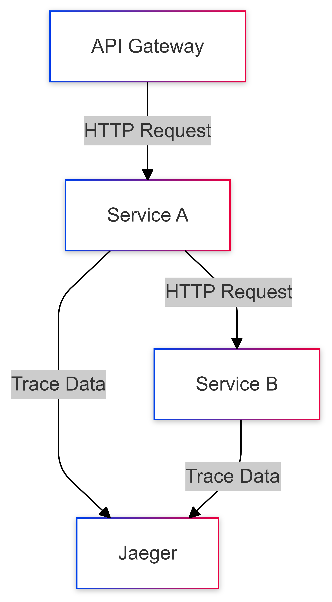

# Distributed Tracing Project

## Overview

This project implements a distributed tracing system using FastAPI, OpenTelemetry, and Jaeger. It consists of an API Gateway and two services (Service A and Service B) that communicate with each other while tracing requests using Jaeger.

## Project Structure

- **API Gateway**: Acts as a central point for routing requests to the services.
- **Service A**: Calls Service B and processes requests.
- **Service B**: Processes requests and returns responses.

<!-- Start of Selection -->
<p align="center">
    
</p>
<!-- End of Selection -->

## Prerequisites

- Docker and Docker Compose
- Python 3.12 or higher

## Installation

1. Clone the repository:

```bash
git clone https://github.com/bmd1905/distributed-tracing-project
cd distributed-tracing-project
```

2. Build and start the services using Docker Compose:

```bash
make up
```

## Usage

- The API Gateway is accessible at `http://localhost:8080`.
- Health check endpoint: `http://localhost:8080/health`
- To call Service B through Service A: `http://localhost:8080/service-a/call-service-b`
- Use `make test` to run tests.

## Tracing

- Tracing is configured using OpenTelemetry and Jaeger.
- Jaeger UI is accessible at `http://localhost:16686` for viewing traces.
